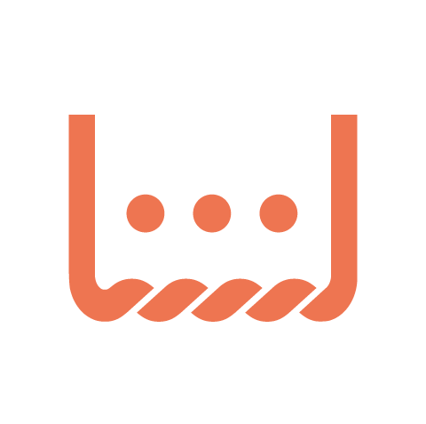

# What Ubitone members do as a TURN member. 

## ABOUT Ubitone
盲ろう者との使用する指点字をベースに新しいコミュニケーションデバイスを模索していくチーム。

## TURNでのAction Ideas
* 周辺アイデアのリサーチ
* デバイスへの入力機能の追加
* デバイスだけを使った音声のないコミュニケーションテスト
* デバイスの新しい形、他チームとの協同案の模索

## Members
- 山蔦栄太郎 Ubitone代表 機械工学専攻
- 橋本瞭 Ubitoneデザイン責任者 デザイン科専攻

## Motivation
* Design & Technologyによる人間の身体性の拡張
* Design & Technologyによる社会の余白の拡大
* 山蔦  
  余裕のない社会に対して息苦しさを感じている。  
  個々人の善意のみに期待されて設計された社会システムには限界があると思うので、Technologyの力を有効活用したいと考えている。  
  情報に飲まれて自分の身体感覚を失っていることが増えているので、皆様とのお話の中でまずは自分自身のマイナスの感覚をゼロに。  
  ニュートラルな状態からさらにプラスに拡張していく方法について考えていきたい。  

* 橋本  
  人の「個」というものに常に関心を抱いている。  
  自分は生まれてから高校に入学するまでシンガポール、ニュージーランド、日本と三ヶ国それぞれ違う文化や人種がいる場所で過ごしていくうちにその場所や周りのコミュニティに合わせて自分が変容していくことを実感した。  
  自身が環境や遺伝など自分の「外」の部分によって形作られるのであれば、自分が「内」だと思って抱いている感情や感覚も本当に自分のものなのだろうかと考えるようになった。  
  そのような過程を経て、大学に入りデザインを学ぶにつれて、広告や製品というものが一般的な共通概念を消費者に前提として求めており、またそれがあることによって共感を得ることができるということを学ぶと、逆にデザイン（もちろん全てに当てはまるわけではないと思うが）というもの身体を通して認識することによって共通概念を強固なものにし、個々の自由な解釈や思考に閉塞感を与えてしまっているのではないかと考えるようになった。  
  自分と異なる身体感覚をお持ちの方たちと話し合い、知ることで身体感覚がどのようにして人の思考や感性に関わるのか、環境からの情報の受け取り方が異なることで「個」がどのようにして形作られるのか知りたい。  

